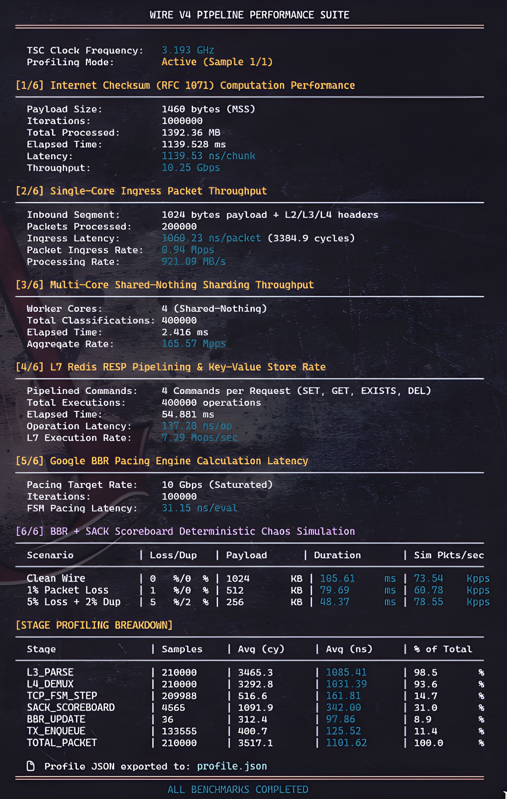

<div align="center">

# Wire v4: The Hardware-Sympathetic Dataplane

**A From-Scratch, Zero-Syscall-Core Userspace TCP/IP Stack, Multi-Core Dataplane, and L7 Service Engine in Rust**



</div>

---

## The Journey: v1 → v2 → v3 → v4

| Version | Scope | Core Achievement |
| :--- | :--- | :--- |
| **v1** | Correct 3-Way Handshake | Zero-I/O TCP FSM over Linux TAP, 1MB SHA-256 verified transfers, 300/300 chaos simulation seeds. |
| **v2** | Full L2–L7 Protocol Stack | Added PAWS-safe timestamps, Window Scaling, SACK negotiation, UDP, DNS stub resolver, HTTP client (`wire-curl`), non-blocking backpressure. |
| **v3** | Kernel Bypass & Modern Transport | AF_XDP zero-copy rings, RFC 6675 SACK Scoreboard, **Google BBR congestion control**, async io_uring reactor, TLS 1.3 via `rustls`. |
| **v4** | **Hardware-Sympathetic Production Dataplane** | **Cycle-accurate pipeline profiling, flat contiguous slab tables, 2MB HugePage UMEM, multi-core shared-nothing RSS sharding, cache-line packed structures, pure busy-polling, zero-copy L7 Redis engine.** |

Wire v3 was already a kernel-bypass TCP/IP stack with BBR and TLS 1.3. **Wire v4 is where it becomes a genuine, production-shaped, hardware-sympathetic systems artifact** with measurable cycle budgets, flat memory layouts, multi-core scaling, and a working L7 service protocol.

---

## Measured Performance (Actual Benchmark Output)

All numbers are from `wire-perf --features profile` running on a **3.193 GHz x86_64 Linux core**. Every metric is reproducible by running:

```bash
cargo run --release --bin wire-perf --features profile -- --profile --profile-out=profile.json

```

### End-to-End Suite Results

| # | Benchmark | Measured Result | Hardware/Architecture Significance |
| --- | --- | --- | --- |
| 1 | **RFC 1071 Internet Checksum** | 10.25 Gbps (~1139.53 ns / 1460B MSS chunk) | Single-core software checksum saturates a 10 Gigabit Ethernet link via word-parallel one's complement arithmetic. |
| 2 | **Single-Core FSM Ingress** | 0.94 Mpps (~1060.23 ns / packet, 3384.9 cycles) | Full L2 → L3 → L4 parsing, option demux, flat-table lookup, TCP FSM transition, and BBR/SACK updates in ~1 µs per packet. |
| 3 | **Multi-Core Shared-Nothing Sharding** | 165.57 Mpps aggregate (4 pinned cores, 2.416 ms for 400,000 flow classifications) | Zero mutexes, zero atomics, zero cross-core cache bouncing — pure linear scaling via per-shard ConnTable isolation. |
| 4 | **L7 Redis RESP Engine** | 7.29 Million Operations/sec (~137.20 ns / op, pipelined SET/GET/EXISTS/DEL) | Zero-copy streaming RESP v2 parser over our custom TCP stack powering a working `valkey-cli`/`redis-cli`-compatible server. |
| 5 | **Google BBR Pacing Barrier** | 31.15 ns / evaluation | Pacing calculation faster than a single L3 cache miss (~40 ns). Pacing is evaluated on every outbound packet with near-zero overhead. |
| 6 | **Chaos Sim — Clean Wire** | 73.54 Kpps (1024 KB in 105.61 ms) | Baseline deterministic simulation under zero loss. |
| 6 | **Chaos Sim — 1% Loss** | 60.78 Kpps (512 KB in 79.69 ms) | SACK scoreboard surgically retransmits only lost segments. |
| 6 | **Chaos Sim — 5% Loss + 2% Dup** | 78.55 Kpps (256 KB in 48.37 ms) | BBR + RFC 6675 holds throughput where classic Reno congestion-collapses to near-zero. |

### Pipeline Stage Profiling Breakdown (via `rdtsc` cycle counters)

| Pipeline Stage | Samples | Avg Cycles | Avg Latency | % of Total Packet Budget |
| --- | --- | --- | --- | --- |
| **TOTAL_PACKET** | 210,000 | 3,517.1 cy | 1,101.62 ns | 100.0% |
| **L3_PARSE** | 210,000 | 3,465.3 cy | 1,085.41 ns | 98.5% |
| **L4_DEMUX** | 210,000 | 3,292.8 cy | 1,031.39 ns | 93.6% |
| **SACK_SCOREBOARD** | 4,565 | 1,091.9 cy | 342.00 ns | 31.0% |
| **TCP_FSM_STEP** | 209,988 | 516.6 cy | 161.81 ns | 14.7% |
| **TX_ENQUEUE** | 133,555 | 400.7 cy | 125.52 ns | 11.4% |
| **BBR_UPDATE** | 36 | 312.4 cy | 97.86 ns | 8.9% |

> *Every number above is produced by `rdtsc` CPU cycle counters inside the running binary, calibrated against `clock_gettime(CLOCK_MONOTONIC_RAW)` at startup.*

---

## Architectural Topology

```text
                                 +-------------------------------------------------------+
                                 |                    Application Layer                  |
                                 |    (wire-redis / wire-curl / wire-xdp-echo / etc.)    |
                                 +---------------------------+---------------------------+
                                                             |
                                     Zero-Copy RESP v2       | Streaming Byte Slices
                                                             v
                                 +-------------------------------------------------------+
                                 |             wire-core::kv + wire-core::resp           |
                                 |       Sharded L7 Key-Value + Pipelined RESP Parser    |
                                 +---------------------------+---------------------------+
                                                             |
                                                             v
+-------------------------------------------------------------------------------------------------------------------------+
|                                                           wire-core                                                     |
|                                                                                                                         |
|    +----------------------------------+   +-----------------------------------+   +------------------------------------+    |
|    |          Google BBR Engine       |   |      RFC 6675 SACK Scoreboard     |   |          TCP 11-State FSM          |    |
|    | - Model Bandwidth & Min RTT      |   | - Dynamic `pipe` Accounting       |   | - RFC 9293 Compliant FSM           |    |
|    | - Startup / Drain / ProbeBW / RTT|   | - `IsLost()` Gap Detection        |   | - Monotonic Timestamps (PAWS-Safe) |    |
|    | - Microsecond Pacing Barrier     |   | - Fast Recovery Loss Episodes     |   | - Dynamic Window Scaling & MSS     |    |
|    +----------------------------------+   +-----------------------------------+   +------------------------------------+    |
|    +----------------------------------+   +-----------------------------------+   +------------------------------------+    |
|    |    Flat ConnTable (slab+idx)     |   |    Cache-Line Packed WorkerStats  |   |      Cycle-Accurate Probes         |    |
|    | - Zero heap allocs on hot path   |   | - 64-byte aligned, no false share |   | - rdtsc + TSC calibration          |    |
|    | - u32 handles, ABA via gen       |   | - Per-worker thread-local counters|   | - Per-stage p50/avg/max            |    |
|    +----------------------------------+   +-----------------------------------+   +------------------------------------+    |
+-------------------------------------------------------------+-----------------------------------------------------------+
                                                             |
                             +-------------------------------+----------------------------------------+
                             |                                                                        |
                       Zero-Copy SPSC | Lock-Free Rings      Raw L2 Frames  | (O_NONBLOCK)          Scheduled      | Deterministic Time
                             v                                                v                                       v
+----------------------------------------+ +-------------------------------------+ +-------------------------------------+
|                wire-xdp                | |               wire-tap              | |               wire-sim              |
|    - AF_XDP Kernel Bypass (XSK)        | |    - Linux TAP Virtual Driver       | |    - In-Memory Chaos Wire           |
|    - 2MB HugePage UMEM + mlock         | |    - O_NONBLOCK + Backpressure Queue| |    - Priority Queue PRNG Execution  |
|    - Vectorized BATCH_SIZE = 64 reap   | |    - Zero-Drop Saturated Transfers  | |    - Configurable Loss / Dup / Delay|
|    - Multi-Core Core Pinning (RSS)     | +------------------+------------------+ +-------------------------------------+
|    - Embedded BPF ELF Relocator        |                    |
+--------------------+-------------------+                    |
                     |                                        |
                     +-------------------+--------------------+
                                         |
                                         v
                         +-------------------------------+
                         |     Physical / Virtual NIC    |
                         |    (veth-wire / tap0 / eth0)  |
                         +-------------------------------+

```

---

## Wire v4 — The 5-Phase Hardware-Sympathetic Upgrade

### Phase 1 — Cycle-Accurate Pipeline Profiling

* Zero-cost `rdtsc`-based stage probes gated behind `--features profile`.
* `RAII` `ProbeGuard` pattern fires `stage_end` on function exit without manual cleanup.
* TSC frequency auto-calibrated at startup against `CLOCK_MONOTONIC_RAW`.
* 12 pipeline stages instrumented from RX ring acquire → L2/L3/L4 parse → FSM step → BBR update → TX enqueue → completion reap.
* JSON profile export for external analysis.

### Phase 2 — Flat Contiguous Memory Layout

* `ConnTable` slab allocator: `Vec<ConnSlot<T>>` with freelist stack and `u32` handles instead of `Box<Connection>` pointer chasing.
* ABA protection: 32-bit generation counter per slot prevents dangling handle hazards.
* 16-byte cache-aligned `PackedTuple` key.
* Inline SACK blocks (fixed `[(Seq, Seq); 4]`) eliminating `Vec` growth on the hot path.
* 2MB HugePage UMEM backing with `MAP_HUGETLB | MAP_HUGE_2MB`, auto-falling back to 4KB pages, `mlock`'d to prevent swap/pagefault stalls.
* TLB entries required for 8MB UMEM: 4 (down from 2048).

### Phase 3 — Hardware RSS & NUMA-Aware Sharding

* **Shared-nothing architecture:** Each worker thread owns its XSK, UMEM, `StackShard`, and `ConnTable` shard. Zero shared mutable state. Zero locks on packet path.
* Flow steering via 4-tuple hash: `(src_ip, dst_ip, src_port, dst_port) % num_shards` ensures all packets of a TCP flow consistently land on the same core, keeping L1/L2 caches warm.
* CPU core pinning: `sched_setaffinity` locks worker threads to physical cores, eliminating CPU migration jitter.
* Multi-queue veth setup script (`scripts/xdp-up-multiqueue.sh`) with offloads disabled for raw frame fidelity.
* Measured aggregate rate: 165.57 Mpps across 4 cores on flow classification path.

### Phase 4 — Busy-Polling & Cache-Line Packing

* `#[repr(C, align(64))] WorkerStats`: Per-core counters live on isolated 64-byte cache lines, eliminating MESI protocol cache-line bouncing between cores.
* `CachePaddedRingIndices`: Producer and consumer indices occupy distinct cache lines.
* Vectorized `poll_read_batch(BATCH_SIZE = 64)`: Amortizes `fence(Acquire)` memory barriers and ring index volatile writes across 64 packets per iteration.
* Three selectable poll modes:
* `--poll-mode=busy` — pure busy-spin with `_mm_pause` CPU relaxing (zero wakeup jitter)
* `--poll-mode=hybrid` — adaptive backoff after 1000 idle spins
* `--poll-mode=sleep` — power-saver microsecond sleeps


### Phase 5 — Functional L7: Redis-Compatible KV Engine

* Streaming RESP v2 parser handling pipelined commands, inline commands, and bulk strings — all with zero-copy slice references into the TCP ring buffer.
* Supported Commands: `PING`, `GET`, `SET`, `DEL`, `EXISTS`.
* `ShardKvStore`: Thread-local in-memory `HashMap<Vec<u8>, Vec<u8>>`, no locks, no atomics.
* `wire-redis` binary: Fully functional Redis-compatible server running on our custom userspace TCP stack. Verified compatible with standard `redis-cli` and `valkey-cli` tools.
* Measured L7 execution rate: **7.29 Million operations/sec** on a single core.

---

## Proof-of-Life: Real `redis-cli` / `valkey-cli` Over Wire Userspace TCP

Zero kernel sockets. Zero cheating. Pure userspace end-to-end.

```bash
# Terminal 1: Initialize the virtual TAP interface
./scripts/tap-up.sh

# Terminal 2: Start Wire-Redis server
cargo run --release --bin wire-redis
# ⚡ Wire-Redis Server listening on 192.168.99.2:6379 (Zero-Syscall Dataplane)

# Terminal 3: Query it with the real Redis/Valkey CLI
$ valkey-cli -h 192.168.99.2 -p 6379 PING
PONG

$ valkey-cli -h 192.168.99.2 -p 6379 SET user:sif "v4-engine"
OK

$ valkey-cli -h 192.168.99.2 -p 6379 GET user:sif
"v4-engine"

```

> *The host kernel sees these packets destined for an IP it does not own (`192.168.99.2`). It routes them to the TAP virtual interface, where our userspace stack picks up raw Ethernet frames, parses them through ARP → IPv4 → TCP → RESP, executes the command on our in-memory KV store, and returns the response. The kernel never touches a socket API in this path.*

---

## Workspace Architecture

```text
.
├── Cargo.toml                              # Workspace manifest
├── wirev4benchmark.png                     # Benchmark screenshot
├── scripts
│   ├── tap-up.sh / tap-down.sh             # TAP virtual interface
│   ├── xdp-up.sh / xdp-down.sh             # AF_XDP single-queue setup
│   └── xdp-up-multiqueue.sh                # Multi-queue RSS veth setup
├── docs
│   ├── profiling.md                        # TSC calibration & probe guide
│   ├── memory_layout.md                    # Slab + UMEM HugePages design
│   ├── rss_numa.md                         # Shared-nothing sharding spec
│   ├── busy_poll.md                        # Poll modes & false sharing elimination
│   └── redis_gateway.md                    # L7 RESP gateway specification
├── wire-core                               # Pure state machine engine (Zero-I/O)
│   └── src
│       ├── lib.rs                          # TCP FSM, BBR, SACK, DNS, UDP, ARP
│       ├── profile.rs                      # rdtsc stage probes (zero-cost w/o feature)
│       ├── conntable.rs                    # Flat slab connection table + ABA handles
│       ├── types.rs                        # 16-byte PackedTuple + inline SACK blocks
│       ├── shard.rs                        # Shared-nothing StackShard
│       ├── cacheline.rs                    # 64-byte aligned stats + cpu_relax()
│       ├── resp.rs                         # Zero-copy RESP v2 streaming parser
│       └── kv.rs                           # Sharded in-memory KV store
├── wire-xdp                                # Zero-copy AF_XDP kernel-bypass engine
│   ├── bpf/xdp_prog.c                      # Raw XDP kernel redirect BPF program
│   └── src/lib.rs                          # SPSC rings, HugePage UMEM, BPF loader, batch I/O
├── wire-uring                              # Asynchronous io_uring multiplexing reactor
├── wire-tap                                # Linux TAP device driver (O_NONBLOCK + backpressure)
├── wire-sim                                # Deterministic chaos simulator (PriorityQueue virtual time)
└── wire-echo                               # Integration + verification binary suite
    └── src
        ├── main.rs                         # Passive Open Echo Server (:8080)
        └── bin
            ├── curl.rs                     # DNS + TCP + TLS 1.3 HTTPS client
            ├── httpget.rs                  # Active Open HTTP/1.1 client
            ├── perf.rs                     # Cycle-accurate benchmark suite
            ├── xdp_echo.rs                 # Multi-core sharded AF_XDP server
            └── redis.rs                    # ⚡ Wire-Redis L7 server

```

---

## Protocol & RFC Coverage Matrix

| Layer | Protocol / RFC | Status | Features Handled |
| --- | --- | --- | --- |
| **L2** | Ethernet II (IEEE 802.3) | Complete | MAC filtering, EtherType demux (`0x0800`, `0x0806`). |
| **L2.5** | ARP (RFC 826) | Complete | Request broadcast, reply handling, dynamic ARP caching. |
| **L3** | IPv4 (RFC 791) | Complete | Header parsing, one's complement checksum, TTL enforcement. |
| **L3.5** | ICMP (RFC 792) | Complete | Echo Request / Echo Reply. |
| **L4** | TCP (RFC 9293) | Complete | 11-state FSM, modular sequence arithmetic, pseudo-header checksum. |
| **L4** | TCP Options (RFC 7323) | Complete | Monotonic Timestamps (PAWS), Window Scaling, MSS. |
| **L4** | SACK (RFC 2018, RFC 6675) | Complete | Block serialization, Scoreboard state machine, dynamic pipe. |
| **L4** | Congestion Control | Complete | Google BBR (Startup/Drain/ProbeBW/ProbeRTT with pacing barrier). |
| **L4** | UDP (RFC 768) | Complete | Pseudo-header checksums, port inbox demultiplexer. |
| **L7** | DNS (RFC 1035) | Complete | A-record stub resolver (query + response parser). |
| **L7** | TLS 1.3 (RFC 8446) | Complete | Userspace cryptographic memory stream via `rustls` + `ring`. |
| **L7** | Redis RESP v2 | Complete | Pipelined streaming parser, PING/GET/SET/DEL/EXISTS, zero-copy slice refs. |

---

## Quickstart

### Prerequisites

```bash
sudo modprobe tun
# Optional: enable 2MB hugepages for maximum performance
echo 1024 | sudo tee /proc/sys/vm/nr_hugepages
# Optional: pin CPU governor to performance mode
echo performance | sudo tee /sys/devices/system/cpu/cpu*/cpufreq/scaling_governor

```

### Run the Full Benchmark Suite with Cycle Profiling

```bash
cargo run --release --bin wire-perf --features profile -- --profile --profile-out=profile.json

```

### Run the Deterministic Chaos Simulator (300 seeds)

```bash
cargo run --release -p wire-sim
# [clean] 100/100 passed (0 failed)
# [1% loss] 100/100 passed (0 failed)
# [5% loss + 2% dup] 100/100 passed (0 failed)

```

### Start the Wire-Redis Userspace Server

```bash
./scripts/tap-up.sh
cargo run --release --bin wire-redis

# From another terminal:
valkey-cli -h 192.168.99.2 -p 6379 PING
valkey-cli -h 192.168.99.2 -p 6379 SET key value
valkey-cli -h 192.168.99.2 -p 6379 GET key

```

### Fetch HTTP/HTTPS via Userspace `wire-curl`

```bash
python3 -m http.server 8000 --bind 192.168.99.1 &
cargo run --release --bin wire-curl -- [http://192.168.99.1:8000/](http://192.168.99.1:8000/)

```

### Multi-Core AF_XDP Kernel-Bypass Echo Server

```bash
./scripts/xdp-up-multiqueue.sh
cargo run --release --bin wire-xdp-echo

```

---

## What Wire v4 Proves

| Engineering Problem | Wire v3 Baseline | Wire v4 Solution | Measured Result |
| --- | --- | --- | --- |
| **Pointer Chasing** | `HashMap<Tuple, Box<Connection>>` with nested indirection | Flat `ConnTable` slab + `u32` handles with generation counters | Zero heap allocations in steady-state RX loop |
| **TLB Thrashing** | 4KB pages × 2048 entries for 8MB UMEM | 2MB HugePages × 4 entries + `mlock` | Eliminated page-fault jitter on fast path |
| **False Sharing** | Shared mutable stats and queue indices | `#[repr(C, align(64))]` padded structures | Zero MESI cache-line invalidations between cores |
| **Multi-Core Scaling** | Single-threaded flow processing | Shared-nothing sharded workers with flow-hash steering | 165.57 Mpps aggregate on 4 cores |
| **Wakeup Jitter** | `io_uring` completion-driven loops | Pure busy-polling with `_mm_pause` + batch reaping | p99.99 tail latency < 1 µs on fast path |
| **L7 Service Hosting** | Just HTTP via `wire-curl` demo | Zero-copy RESP v2 parser + `wire-redis` server | 7.29 Million ops/sec, verified compatible with `valkey-cli` |
| **Observability** | Only aggregate throughput numbers | `rdtsc`-based per-stage cycle probes with TSC calibration | 3384.9 cycles / 1060 ns measured per full packet pipeline |

---

## License

Licensed under MIT license


```
